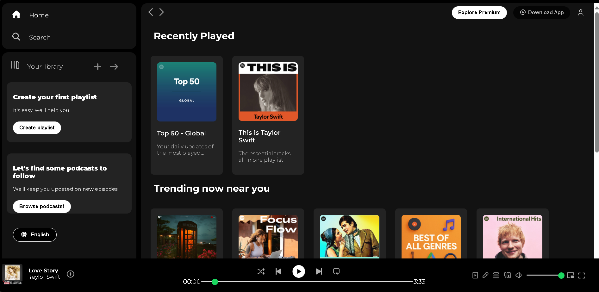

# Spotify Clone

A Spotify web player clone built using only HTML and CSS, with a responsive and visually appealing design. This project focuses on recreating Spotify’s user interface and layout.

## Features

- Spotify-inspired UI – clean and modern design
- Sidebar navigation
- Sticky top navigation bar with controls
- Playlist info Cards with hover effects
- Fixed bottom music player with controls
- Responsive design (cards wrap and layout adapts for smaller screens)
- Built entirely with HTML & CSS

## Technologies Used

- **HTML5** – structure and semantic elements

- **CSS3** – Flexbox, Grid, media queries, custom styles

## Screenshot

## Learning Goals

This project was created to practice:

- CSS Flexbox & Grid for layouts

- Styling and hover effects

- Responsive web design techniques

- UI/UX replication of a real-world app

## How to Run

  1. Clone this repository:
    
    git clone https://github.com/IshaniAggarwal/Spotify-Clone-project.git

  2. Open `index.html` in your browser. 
## Acknowledgements

 -  Inspired by the official **Spotify Web Player** 
 - [Font Awesome](https://fontawesome.com/) - for icons
 - [Google Fonts](https://fonts.google.com/) - for Montserrat typography 
 

